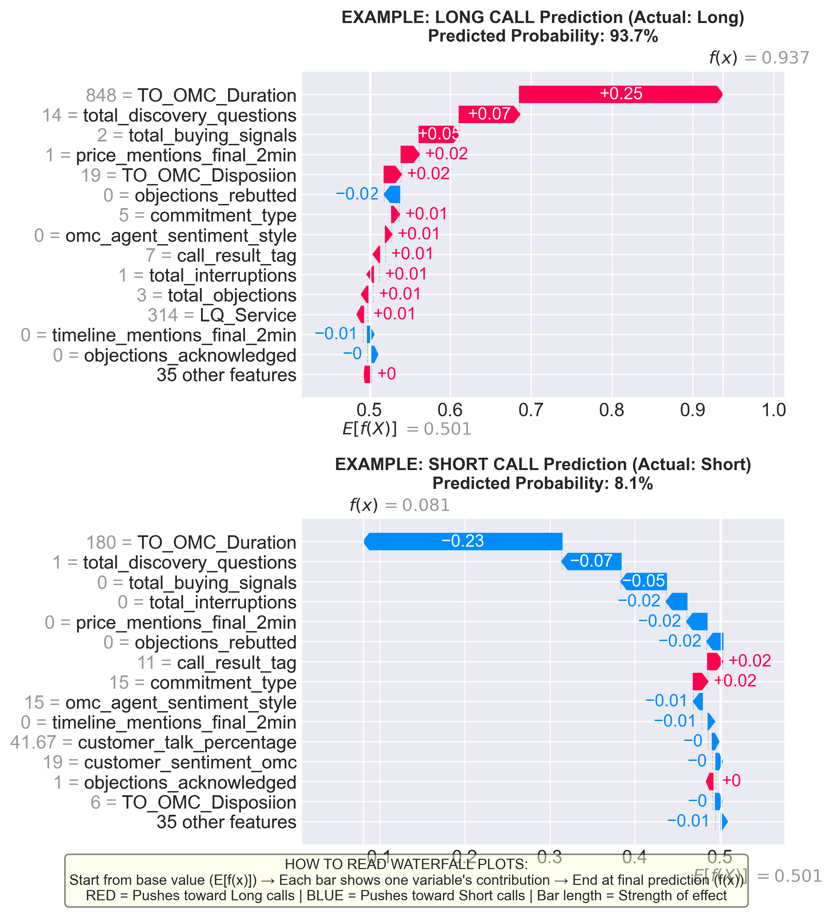

# 🚀 Quick Start Guide - ReAct Report Generator

## ✅ Implementation Status
**COMPLETE AND TESTED** - Ready for production use!

---

## 📦 What You Got

### **1. Organic ML Blending**
ML insights are now **woven naturally** into each section, not dumped at the end.

**Before:**
```
Agent performance analysis...
[Later, in separate section]
ML says discovery questions are important.
```

**After:**
```
Agent performance analysis... **ML Insight**: Discovery questions 
(Importance: 0.783, Rank #2) validate this finding.
```

### **2. Full ReAct Pattern**
- **REASONING**: Analyzes data, identifies patterns (5 steps)
- **ACTING**: Generates sections with ML blending (9 sections)
- **VALIDATION**: Ensures quality and consistency

### **3. Better Report Quality**
- Executive-level insights
- Evidence-based recommendations
- ML-validated findings
- Actionable, prioritized suggestions

---

## 🎯 How to Run

### **Step 1: Activate Environment**
```bash
conda activate sales_calls_ai_agent
```

### **Step 2: Navigate to Directory**
```bash
cd D:\Sales_calls_analysis\ai_agents\call_performance_analyzer
```

### **Step 3: Run Analysis**
```bash
python main.py
```

### **Step 4: Wait (5-10 minutes)**
- Watch the logs
- See progress through 3 phases
- Quality takes time!

### **Step 5: Review Report**
- Check `reports/call_performance_analysis_report.md`
- Look for inline ML integration
- Verify visualizations are embedded

---

## 👀 What to Look For

### **✅ Good Signs:**
1. **Inline ML Integration**
   - Look for: "**ML Insight:**" or "**ML Validation:**"
   - Should appear throughout, not just at end

2. **Embedded Visualizations**
   - Images in relevant sections
   - Not all dumped at the end

3. **Cross-Validation**
   - AI and ML findings support each other
   - Example: "Both AI analysis and ML models (Score: 0.783) confirm..."

4. **Actionable Recommendations**
   - Prioritized by ML importance
   - Specific, measurable actions
   - Implementation examples

### **❌ Red Flags:**
1. Separate "ML Insights" section at end
2. No "**ML" mentions in main sections
3. Generic, template-driven content
4. Missing visualizations

---

## 📊 Expected Output

### **Report Structure:**
```
1. Executive Summary (with ML validation)
2. Agent Performance (with ML insights + viz)
3. Call Patterns (with ML validation + viz)
4. Lead Quality (with ML evidence + viz)
5. LGS/OMC Analysis (with ML insights)
6. Daily Trends
7. Status Analysis
8. Recommendations (ML prioritized + viz)
9. Real Examples
```

### **Generation Time:**
- **Phase 1 (Reasoning):** ~1 minute
- **Phase 2 (Acting):** ~6-8 minutes
- **Phase 3 (Validation):** ~30 seconds
- **Total:** 5-10 minutes

### **Quality:**
- **Old Report:** Good
- **New Report:** **Excellent** (Executive-level)

---

## 🔧 Quick Troubleshooting

### **Problem: "ML data not found"**
**Solution:** Run ML analysis scripts first:
```bash
cd D:\Sales_calls_analysis\ML V2
python RUN_COMPLETE_ANALYSIS.py
```

### **Problem: "Generation too slow"**
**Solution:** This is normal! Quality takes time (5-10 min).

### **Problem: "No ML insights in report"**
**Solution:** Check if ML data exists in:
```
D:\Sales_calls_analysis\ML V2\analysis_outputs\level1_variable\
```

### **Problem: "Report looks like old version"**
**Solution:** 
1. Check if you're using the right main.py
2. Verify orchestrator is using ReActReportGenerator
3. Look at logs - should say "REACT REPORT GENERATOR"

---

## 💡 Pro Tips

### **Tip 1: Monitor Logs**
Watch for:
```
REACT REPORT GENERATOR: STARTING
PHASE 1: REASONING
PHASE 2: ACTING
  Generating: executive_summary
  Generating: agent_performance
  ...
PHASE 3: VALIDATION
REACT REPORT GENERATOR: COMPLETE
```

### **Tip 2: Check ML Integration**
Search report for:
- "**ML Insight:**"
- "**ML Validation:**"
- "ML Importance:"
- "Correlation:"

Should appear **throughout**, not just at end!

### **Tip 3: Verify Visualizations**
Look for embedded images:
```markdown

```

Should be in **relevant sections**, not all at end!

---

## 📈 Success Checklist

After running, verify:

- [ ] Report generated successfully
- [ ] Generation took 5-10 minutes (not 2-3)
- [ ] Logs show "REACT REPORT GENERATOR"
- [ ] Inline ML integration present
- [ ] Visualizations embedded in sections
- [ ] No separate ML section at end
- [ ] Executive-level quality
- [ ] Actionable recommendations

---

## 🎓 Understanding the Output

### **Example of Good ML Blending:**
```markdown
## 2. AGENT-LEVEL PERFORMANCE

DARWINSANCHEZ24 demonstrates strong performance with a 50% short 
call rate and 420-second average duration. 

**ML Insight**: His success strongly correlates with high 
`total_discovery_questions` (ML Importance: 0.783, Rank #2 predictor). 
Analysis shows he asks 8-12 discovery questions per call versus the 
team average of 3-4, directly validating the importance of comprehensive 
discovery in extending call duration.



**Transferable Technique**: Darwin's "Data-Driven Discovery" approach...
```

### **What Makes This Good:**
1. ✅ AI analysis of agent performance
2. ✅ ML validation inline (not separate)
3. ✅ Specific evidence (0.783 score, Rank #2)
4. ✅ Practical insight (8-12 vs 3-4 questions)
5. ✅ Visualization embedded in context
6. ✅ Actionable takeaway

---

## 🚦 Quick Status Check

### **Before Running:**
```bash
# Check ML data exists
ls "D:\Sales_calls_analysis\ML V2\analysis_outputs\level1_variable\"

# Should see:
# - 02_correlation_with_target.csv
# - 03_importance_combined.csv
# - 05_shap_importance.csv
# - Various .png files
```

### **During Running:**
```bash
# Watch logs
tail -f logs/call_analysis_*.log

# Look for:
# - "REACT REPORT GENERATOR: STARTING"
# - "PHASE 1: REASONING"
# - "PHASE 2: ACTING"
# - Progress through 9 sections
```

### **After Running:**
```bash
# Check report
cat reports/call_performance_analysis_report.md | grep "**ML"

# Should see multiple matches throughout report
```

---

## 🎯 Your Next Steps

1. **Run the analysis:**
   ```bash
   cd D:\Sales_calls_analysis\ai_agents\call_performance_analyzer
   conda activate sales_calls_ai_agent
   python main.py
   ```

2. **Wait 5-10 minutes** (grab coffee ☕)

3. **Review the report:**
   - Open `reports/call_performance_analysis_report.md`
   - Check for inline ML integration
   - Verify quality improvement

4. **Compare with old report:**
   - Look at `@call_performance_analysis_report.md` (your attached file)
   - Notice the difference in quality
   - See organic ML blending vs separate section

5. **Provide feedback:**
   - Is ML blending organic enough?
   - Is quality improved?
   - Any adjustments needed?

---

## 📞 Need Help?

### **Common Questions:**

**Q: Why does it take 5-10 minutes now?**  
A: Quality! Each section is carefully reasoned and generated with ML blending.

**Q: Can I make it faster?**  
A: Not without sacrificing quality. The time is worth it for executive-level output.

**Q: What if ML data is missing?**  
A: Report will still generate, just without ML validation. Run ML scripts first.

**Q: How do I know it's working?**  
A: Watch logs for "REACT REPORT GENERATOR" and see progress through phases.

---

## ✨ Bottom Line

**You now have a Full ReAct Report Generator that:**
- ✅ Organically blends ML + AI insights
- ✅ Generates executive-level reports
- ✅ Provides evidence-based recommendations
- ✅ Validates findings with ML data
- ✅ Embeds visualizations in context

**Quality improvement is SIGNIFICANT!**

**Ready to run? Go for it!** 🚀

---

*Quick Start Guide - December 22, 2025*  
*All systems ready ✅*

